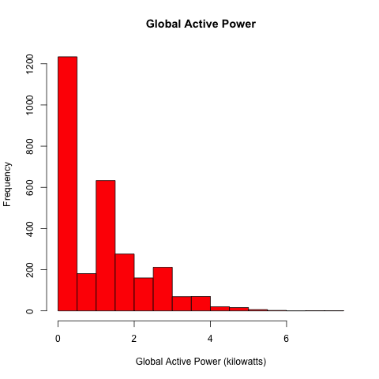
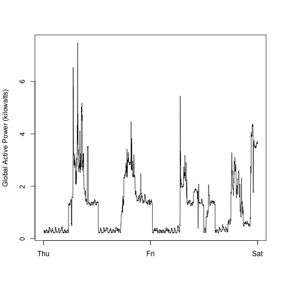
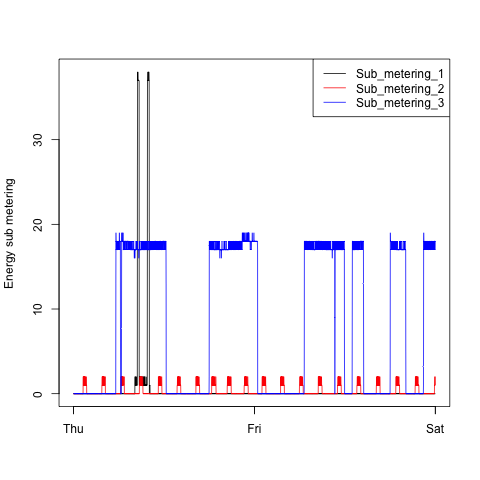
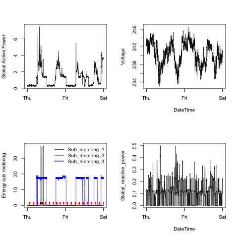

# Project 1
James Black  
8 October 2014  

This is the make file for Project one.

## Instructions

For each plot you should

* Construct the plot and save it to a PNG file with a width of 480
pixels and a height of 480 pixels.

* Name each of the plot files as `plot1.png`, `plot2.png`, etc.

* Create a separate R code file (`plot1.R`, `plot2.R`, etc.) that
constructs the corresponding plot, i.e. code in `plot1.R` constructs
the `plot1.png` plot. Your code file **should include code for reading
the data** so that the plot can be fully reproduced. You should also
include the code that creates the PNG file.

* Add the PNG file and R code file to your git repository

## Load the data

```r
  workingdir <- "~/datasciencecoursera/explore/project1"
```


```r
  setwd(workingdir)

## Pop over and get the file
  temp <- tempfile()
  download.file("http://archive.ics.uci.edu/ml/machine-learning-databases/00235/household_power_consumption.zip",temp)

## read it in
  data <- read.table(unzip(temp, "household_power_consumption.txt"),
                     sep=";", header=TRUE, dec=".", na.strings = "?")
  unlink(temp) # unlinks auto?  

## set date, get 1/2/2007 to 2/2/2007 and save as proj1data
  data$DateTime <- strptime(paste(data$Date, data$Time), "%d/%m/%Y %H:%M:%S")
  proj1data <- data[(data$DateTime>=as.POSIXlt("2007-02-01 00:00:00") & 
                       data$DateTime<=as.POSIXlt("2007-02-03 00:00:00")) ,]
  write.csv(proj1data, file = "proj1data.csv")
```

## Plot 1


```r
  setwd(workingdir)

  source("plot1.r", echo=T)
```

```
## 
## > data <- read.csv("proj1data.csv")
## 
## > data$DateTime <- as.POSIXlt(data$DateTime)
## 
## > png(filename = "plot1.png", width = 480, height = 480, 
## +     units = "px")
## 
## > hist(data$Global_active_power, main = "Global Active Power", 
## +     xlab = "Global Active Power (kilowatts)", col = "red")
```

```
## 
## > dev.off()
## pdf 
##   2
```



## Plot 2


```r
  setwd(workingdir)

  source("plot2.r", echo=T)
```

```
## 
## > data <- read.csv("proj1data.csv")
## 
## > data$DateTime <- as.POSIXlt(data$DateTime)
## 
## > png(filename = "plot2.png", width = 480, height = 480, 
## +     units = "px")
## 
## > plot(data$DateTime, data$Global_active_power, type = "l", 
## +     xlab = "", ylab = "Global Active Power (kilowatts)")
```

```
## 
## > dev.off()
## pdf 
##   2
```



## Plot 3


```r
  setwd(workingdir)

  source("plot3.r", echo=T)
```

```
## 
## > data <- read.csv("proj1data.csv")
## 
## > data$DateTime <- as.POSIXlt(data$DateTime)
## 
## > png(filename = "plot3.png", width = 480, height = 480, 
## +     units = "px")
## 
## > plot(data$DateTime, data$Sub_metering_1, type = "l", 
## +     xlab = "", ylab = "Energy sub metering", col = "Black")
```

```
## 
## > lines(data$DateTime, data$Sub_metering_2, type = "l", 
## +     col = "Red")
## 
## > lines(data$DateTime, data$Sub_metering_3, type = "l", 
## +     col = "Blue")
## 
## > legend("topright", lty = 1, lwd = 1, col = c("Black", 
## +     "Red", "Blue"), legend = c("Sub_metering_1", "Sub_metering_2", 
## +     "Sub_metering_3") .... [TRUNCATED] 
## 
## > dev.off()
## pdf 
##   2
```



## Plot 3


```r
  setwd(workingdir)

  source("plot4.r", echo=T)
```

```
## 
## > data <- read.csv("proj1data.csv")
## 
## > data$DateTime <- as.POSIXlt(data$DateTime)
## 
## > png(filename = "plot4.png", width = 480, height = 480, 
## +     units = "px")
## 
## > par(mfrow = c(2, 2))
## 
## > with(data, plot(DateTime, Global_active_power, xlab = "", 
## +     type = "l", ylab = "Global Active Power"))
```

```
## 
## > with(data, plot(DateTime, Voltage, type = "l"))
```

```
## 
## > with(data, plot(DateTime, Sub_metering_1, xlab = "", 
## +     type = "l", ylab = "Energy sub metering"))
```

```
## 
## > with(data, lines(DateTime, Sub_metering_2, col = "red"))
## 
## > with(data, lines(DateTime, Sub_metering_3, col = "blue"))
## 
## > legend("topright", col = c("black", "red", "blue"), 
## +     cex = 1, lwd = 2, bty = "n", legend = c("Sub_metering_1", 
## +         "Sub_metering_2", "S ..." ... [TRUNCATED] 
## 
## > with(data, plot(DateTime, Global_reactive_power, type = "l"))
```

```
## 
## > dev.off()
## pdf 
##   2
```


