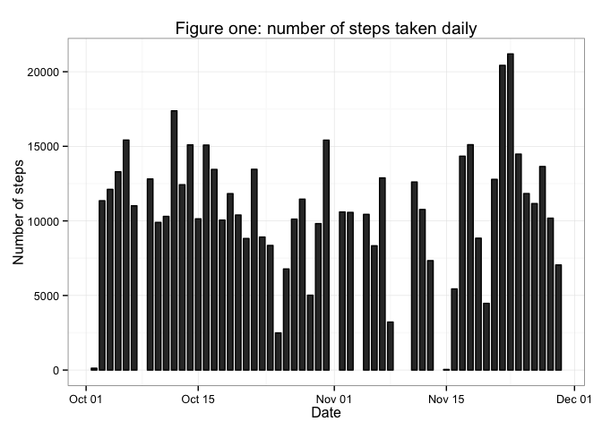
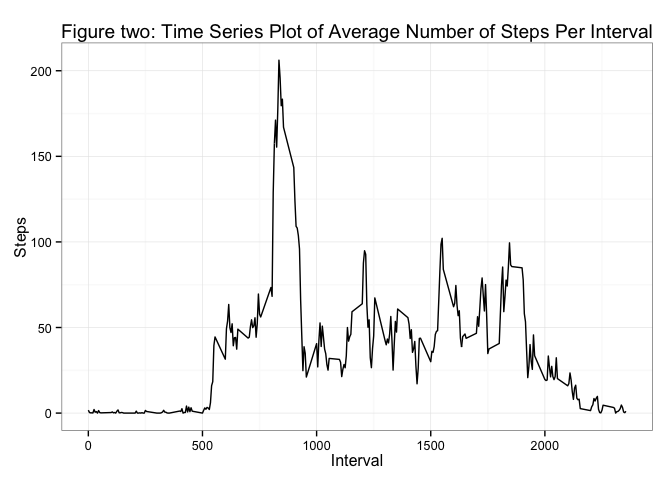
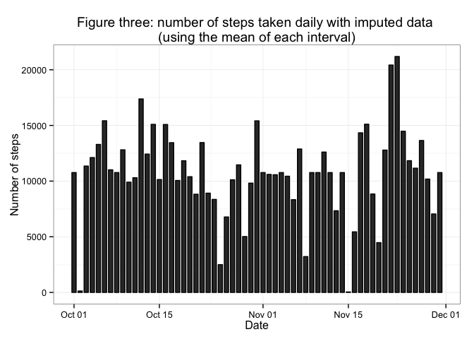
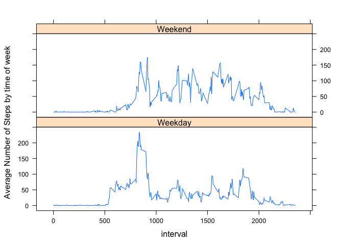

# Reproducible Research: Peer Assessment 1


## Loading and preprocessing the data


```r
library(lattice)
library(knitr)
library(ggplot2)
working_dir <- "~/datasciencecoursera/repoducible/assignment1/"
setwd(working_dir)
raw_data <- as.data.frame(read.csv(file = "activity.csv", header = TRUE))
data <- raw_data
```

Format date into an R readable type. *c_* representing clean.


```r
data$c_date <- as.Date(data$date)
```

Get the minimum, maximum and the duration of follow up.


```r
min_date <- min(data$c_date)
max_date <- max(data$c_date)
total_days <- as.numeric(max_date - min_date)
```

Describe the missing data, and subset to just the complete cases.


```r
sapply(raw_data, function(x) sum(is.na(x)))
```

```
##    steps     date interval 
##     2304        0        0
```

```r
data <- na.omit(data)
```

Create a daily dataset


```r
daily_data <-
  aggregate(formula = steps~c_date, 
            data = data,
            FUN = sum)
```

## What is mean total number of steps taken per day?


```r
mean_steps <- round(
  mean(daily_data$steps),
  2)  
mean_steps # MEAN
```

```
## [1] 10766
```

```r
median_steps <- quantile(x = daily_data$steps, 
                         probs = 0.5)  # p50
median_steps # MEDIAN
```

```
##   50% 
## 10765
```

Figure one is a histogram of the number of steps taken over the days.


```r
ggplot(data=daily_data, 
       aes(x=c_date, y=steps)) + 
    geom_bar(colour="black", width=.7, stat="identity") + 
    guides(fill=FALSE) +
    xlab("Date") + ylab("Number of steps") +
    ggtitle("Figure one: number of steps taken daily") +
  theme_bw()
```

 

```r
ggsave(paste0(working_dir,"figure/figure1.png"))
```

```
## Saving 7 x 5 in image
```

## What is the average daily activity pattern?

Create a data frame containing the mean number of steps for each interval.


```r
interval_data <- aggregate(steps ~ interval, 
                           data = data,
                           FUN = mean)
```

And which interval has the most steps.


```r
max_interval_steps <- max(interval_data$steps)
subset(interval_data,steps==max_interval_steps)
```

```
##     interval steps
## 104      835 206.2
```

So the 835th interval has the most, with 206.2 (1.d.p.) steps.

Plot the average number of steps per interval.


```r
ggplot(data=interval_data, 
  aes(x=interval, y=steps)) + 
  geom_line() + 
  ggtitle("Figure two: Time Series Plot of Average Number of Steps Per Interval")+
  xlab("Interval")+ylab("Steps") +
  theme_bw()
```

 

```r
ggsave(paste0(working_dir,"figure/figure2.png"))
```

```
## Saving 7 x 5 in image
```

## Imputing missing values

Total missing data - 2304 observations are missing steps!


```r
sapply(raw_data, function(x) sum(is.na(x)))
```

```
##    steps     date interval 
##     2304        0        0
```

So I'll take the mean of each interval, and slot it into missing.


```r
imputed_data <- raw_data
imputed_data$c_date <- as.Date(imputed_data$date)
imputed_data$steps <- ifelse(is.na(imputed_data$steps), 
                             interval_data$steps[match(
                               imputed_data$interval, interval_data$interval
                               )], 
                             imputed_data$steps)
```

Figure three, number of steps daily using imputed data.


```r
daily_imputeddata <-
  aggregate(formula = steps~c_date, 
            data = imputed_data,
            FUN = sum)

ggplot(data=daily_imputeddata, 
       aes(x=c_date, y=steps)) + 
    geom_bar(colour="black", width=.7, stat="identity") + 
    guides(fill=FALSE) +
    xlab("Date") + ylab("Number of steps") +
    ggtitle("Figure three: number of steps taken daily with imputed data \n(using the mean of each interval)") +
  theme_bw()
```

 

```r
ggsave(paste0(working_dir,"figure/figure3.png"))
```

```
## Saving 7 x 5 in image
```

Display the means and medians of the complete case *(no missing data)* and the
 imputed data.


```r
paste0("The mean number of steps for the raw data was ",
       round(mean_steps,2),
       "and for the imputed data, it was ",
       round(mean(daily_imputeddata$steps),2))
```

```
## [1] "The mean number of steps for the raw data was 10766.19and for the imputed data, it was 10766.19"
```

```r
paste0("The median number of steps for the raw data was ",
       median_steps,
       " and for the imputed data, it was ",
       round(median(daily_imputeddata$steps),2))
```

```
## [1] "The median number of steps for the raw data was 10765 and for the imputed data, it was 10766.19"
```

Using mean replacement has little effect, but would decrease variance. 

## Are there differences in activity patterns between weekdays and weekends?


```r
split_week <- function(date) {
  day <- weekdays(date)
  part <- factor("Weekday", c("Weekday", "Weekend"))
  if (day %in% c("Saturday", "Sunday")) 
    part <- factor("Weekend", c("Weekday", "Weekend"))
  return(part)
}

data$split_week <- sapply(data$c_date, split_week)

interval_data_split <- aggregate(steps ~ interval + split_week, 
                                 data = data,
                                 FUN = mean)

xyplot(steps ~ interval | split_week, 
       data = interval_data_split, type = "l", 
       layout = c(1, 2), ylab = "Average Number of Steps by time of week")
```

 

```r
dev.copy(png,
         filename=paste0(working_dir,"figure/figure4.png"));
```

```
## quartz_off_screen 
##                 3
```

```r
dev.off ();
```

```
## pdf 
##   2
```
